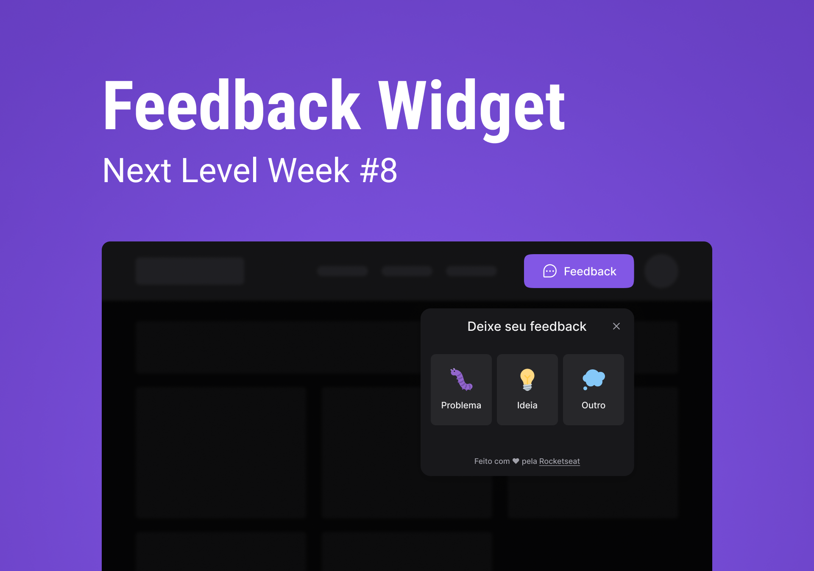

<h1 align="center"> FeedGet Web</h1>

<h3 align="center"> :construction: Projeto em construção :construction: </h3>

## Índice

<p align="center">
  <a href="#tecnologias">Tecnologias</a>&nbsp;&nbsp;&nbsp;|&nbsp;&nbsp;&nbsp;
  <a href="#projeto">Projeto</a>&nbsp;&nbsp;&nbsp;|&nbsp;&nbsp;&nbsp;
  <a href="#layout">Layout</a>&nbsp;&nbsp;&nbsp;|&nbsp;&nbsp;&nbsp;
  <a href="#licença">Licença</a>&nbsp;&nbsp;&nbsp;|&nbsp;&nbsp;&nbsp;
  <a href="#contato">Contato</a>
</p>

<p align="center">
  
</p>

<p align="center">
 
</p>

<p align="center">
  
  
  
  <a href="https://github.com/shateixeira/nlw-return-feedget/commits/master">
    
  </a>


</p>

### IDE


### Utils

&nbsp;
&nbsp;
&nbsp;

## Tecnologias

- [React](https://pt-br.reactjs.org/)
- [TypeScript](https://www.typescriptlang.org/)
- [Node.js](https://nodejs.org/en/)
- [TailwindCSS](https://tailwindcss.com/docs/installation/using-postcss)

Utilitarios

- [Phosphoricons](https://phosphoricons.com/)

Acessibilidade

- [HeadlessUI](https://headlessui.dev/)

## Projeto

Serve para o usuario deixar o seu feedback sobre a plataforma (problema, ideia e outros).

## Layout

> Para ver mais sobre o design, acesse o link [Figma Layout](<https://www.figma.com/file/ntDzMjAFQPVXNtwH0wBmXK/Feedback-Widget-(Community)?node-id=100%3A2114>)

#### Cores Principais

```sass

$brand: #8257e5;
$brand-hover: #996DFF;
$text-on-brand-color: #ffffff;

```

## Licença

Esse projeto está sob a licença MIT. Veja o arquivo [LICENSE](../LICENSE) para mais detalhes.

<!-- ## 📁 Acesso ao projeto

**Indique como é possível baixar ou acessar o código fonte do projeto, seja projeto inicial ou final**

## 🛠️ Abrir e rodar o projeto

**Apresente as instruções necessárias para abrir e executar o projeto** -->

## Contato

[](https://www.linkedin.com/in/shayane-teixeira-4520b2196/)

## Autores

<p align="center">
♥ by Shayane Teixeira ♥
